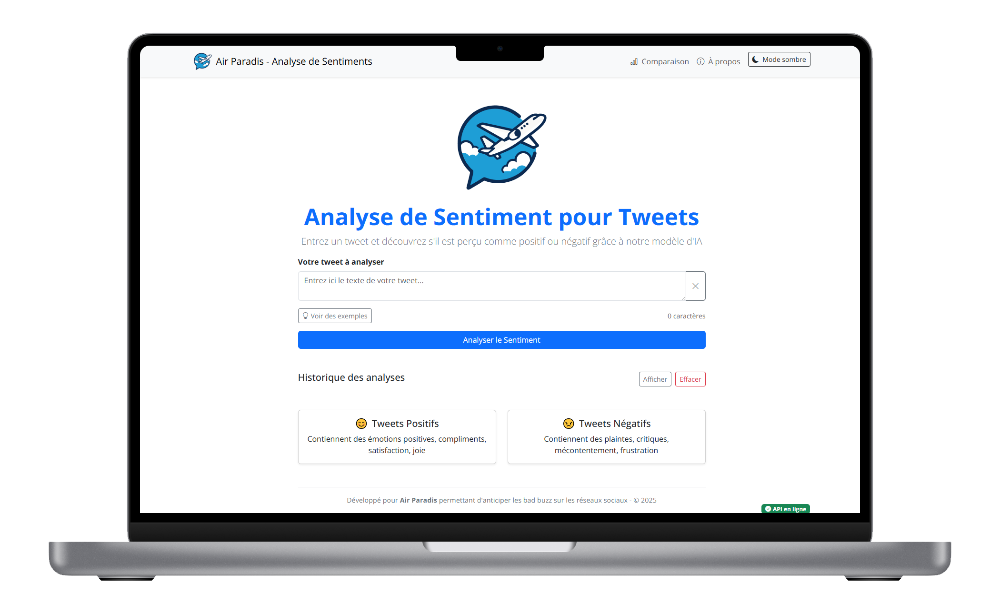

# Projet 7 - Réalisez une analyse de sentiments grâce au Deep Learning


[](https://github.com/DavidScanu/oc-ai-engineer-p07-analyse-sentiments-deep-learning/actions/workflows/heroku-deploy.yml)
[](https://github.com/DavidScanu/oc-ai-engineer-p07-analyse-sentiments-deep-learning/actions/workflows/heroku-deploy.yml)

> 🎓 OpenClassrooms • Parcours [AI Engineer](https://openclassrooms.com/fr/paths/795-ai-engineer) | 👋 *Étudiant* : [David Scanu](https://www.linkedin.com/in/davidscanu14/)


## 📝 Article détaillé 

Retrouvez l'article complet [💬❤️ Analyse de Sentiments de Tweets grâce au Deep Learning : Une Approche MLOps](https://dev.to/davidscanu/analyse-de-sentiments-de-tweets-grace-au-deep-learning-une-approche-mlops-3ib7) qui explique en détails chaque étape du projet.


## 🌐 Contexte

Dans le cadre de ma formation **AI Engineer** chez **OpenClassrooms**, ce projet s'inscrit dans un scénario professionnel où j'interviens en tant qu'ingénieur IA chez MIC (Marketing Intelligence Consulting), entreprise de conseil spécialisée en marketing digital.

Notre client, Air Paradis (compagnie aérienne), souhaite anticiper les bad buzz sur les réseaux sociaux. La mission consiste à développer un produit IA permettant de prédire le sentiment associé à un tweet, afin d'améliorer la gestion de sa réputation en ligne.

## ⚡ Mission

> Développer un modèle d'IA permettant de prédire le sentiment associé à un tweet.

Créer un prototype fonctionnel d'un modèle d'analyse de sentiments pour tweets selon trois approches différentes :

1. **Modèle sur mesure simple** : Approche classique (régression logistique) pour une prédiction rapide
2. **Modèle sur mesure avancé** : Utilisation de réseaux de neurones profonds avec différents word embeddings
3. **Modèle avancé BERT** : Exploration de l'apport en performance d'un modèle BERT

Cette mission implique également la mise en œuvre d'une démarche MLOps complète :

- Utilisation de **MLFlow pour le tracking des expérimentations et le stockage des modèles**.
- Création d'un pipeline de déploiement continu (Git + Github + plateforme Cloud).
- Intégration de tests unitaires automatisés.
- Mise en place d'un suivi de performance en production via Azure Application Insight.

## 🎯 Objectifs pédagogiques

Durant ce projet, je vais :

- **Développer des modèles IA** pour la prédiction de sentiment à partir de données textuelles
- **Mettre en pratique des méthodologies MLOps** pour le déploiement et la gestion continue des modèles
- **Mettre en œuvre un pipeline CI/CD** intégrant des tests unitaires automatisés
- **Configurer un système de suivi** de la performance du modèle en production
- **Préparer des supports de présentation** pour une audience non technique
- **Rédiger un article de blog** mettant en valeur le travail de modélisation et la démarche MLOps

Ces compétences sont essentielles pour ma future carrière d'ingénieur IA, me permettant de gérer des projets complexes et de délivrer des solutions robustes en environnement réel.

## 🗓️ Plan de travail

1. **Exploration et préparation des données**
   - Acquisition des données de tweets *Sentiment140*
   - Analyse exploratoire et prétraitement des textes

2. **Développement des modèles**
   - Implémentation du** modèle classique** (régression logistique)
   - Conception d'un **modèle avancé** utilisant les word embeddings et un **réseau LSTM**
   - Conception d'un **modèle BERT** pour l'analyse de sentiments
   - Comparaison des performances via **MLFlow**

3. **Mise en place de la démarche MLOps**
   - Configuration de MLFlow pour le tracking des expérimentations
   - Création du dépôt Git avec structure de projet appropriée

4. **Développement du backend et du frontend de l'application**
   - Développement de l'API de prédiction avec FastAPI
   - Création de l'interface frontend (Next.js)

4. **Déploiement et monitoring**
   - Implémentation des tests unitaires automatisés
   - Configuration du pipeline de déploiement continu
   - Déploiement sur Heroku
   - Configuration du suivi via Azure Application Insight

5. **Communication**
   - Rédaction de l'article de blog
   - Préparation du support de présentation

## 📦 Livrables

1. **Dépôt GitHub** contenant :
   - Code complet : [GitHub Repository](https://github.com/DavidScanu/oc-ai-engineer-p07-analyse-sentiments-deep-learning)
   - [Notebooks des modélisations](notebooks) avec tracking MLFlow pour les trois approches
   - [Code de déploiement de l'API (FastAPI)](app/fastapi)
   - [Code de l'interface utilisateur (Next.js)](app/frontend)
   - Fichier `README.md` explicatif
   - [Documentation supplémentaire](/documentation) contenant :
     -  [Article de blog](documentation/blog.md)
     -  [Guide de dépoilement sur Heroku](documentation/deploy-api-on-heroku.md)
     -  [Guide Azure Application Insights](documentation/guide-app-insights.md)

3. **Scripts de modélisation** pour les trois approches
   - [Notebooks des trois approches de modélisation](notebooks) 
   - Intégration avec MLFlow pour le tracking et l'enregistrement des modèles

4. **API de prédiction** (FastAPI)
   - Exposant le **Modèle avancé** (LSTM) via FastAPI
   - Mise en place d'un pipeline de déploiement continu (CI/CD)
   - Test automatisés
   - Déploiement sur Heroku (Lien volontaire indisponible sur cette page car il n'est pas protégé par un mécanisme d'authentification)
   - [Guide d'utilisation de l'API FastAPI](app/fastapi/README.md)

5. **Interface Frontend** (Next.js)
   - Permettant la saisie d'un tweet
   - Affichant la prédiction et demandant un feedback à l'utilisateur
   - Envoyant une trace à **Application Insight** en cas de non-validation
   - [Guide d'utilisation du frontend Next.JS](app/frontend/README.md)

6. [Article de blog](https://dev.to/davidscanu/analyse-de-sentiments-de-tweets-grace-au-deep-learning-une-approche-mlops-3ib7)
   - Comparaison des trois approches de modélisation
   - Présentation de la démarche MLOps mise en œuvre
   - Conception et déploiement de l'API de prédiction et de l'interface utilisateur
   - Analyse du suivi de performance en production

7. [Support de présentation](https://docs.google.com/presentation/d/1PY7JPx5ZqY8a9jotuqgLxoTO2WuPdZQvD-EKWPc6k8g/edit?usp=sharing)
   - Méthodologie et résultats des différents modèles
   - Visualisations MLFlow
   - Preuves du pipeline CI/CD (commits, tests unitaires)
   - Captures d'écran du monitoring Application Insight

## 🔧 Technologies utilisées

- **Langages** : Python
- **Bibliothèques ML/DL** : Scikit-learn, TensorFlow/Keras, Transformers (BERT)
- **MLOps** : MLFlow, Git, GitHub Actions
- **Backend** : FastAPI, Heroku
- **Frontend** : Next.js / React
- **Monitoring** : Azure Application Insight
- **Traitement texte** : NLTK, Word Embeddings


## 📃 Documents et Notebooks

- [Guide d'utilisation de l'API FastAPI](app/fastapi/README.md) : API FastAPI qui expose un modèle de deep learning pour l'analyse de sentiment
- [Guide d'utilisation du frontend Next.JS](app/frontend/README.md) : Application Next.js avec Bootstrap pour l'interface utilisateur
- [Guide de Monitoring pour Air Paradis](documentation/guide-app-insights.md) : Mise en place du feedback utilisateur et des alertes avec Azure Application insights
- **Notebooks** :
   - [Analyse exploratoire des données](notebooks/scanu-david-01-notebook-analyse-exploratoire-20250306.ipynb) : Analyse des données du jeu de données "Sentiment140"
   - [Modèle simple](notebooks/scanu-david-02-notebook-modele-simple-20250306.ipynb) : Bag Of Words + Classificateur
   - [Modèle avancé](notebooks/scanu-david-03-notebook-modele-avance-20250306.ipynb) : Word2vec + LSTM (utilisé par l'API en production)
   - [Modèle BERT](https://colab.research.google.com/drive/1TFq3selzmDCTReGfa2NvvlaNSRZMhdzY?usp=sharing) : Entraînement d'un modèle `DistilBertForSequenceClassification` (distilbert-base-uncased)
- [Article de blog complet]()

## 🏛️ Structure du projet

```
📦 oc-ai-engineer-p07-analyse-sentiments-deep-learning/
┣━━ 📂 app/
┃   ┣━━ 📂 fastapi/                         # Backend API de prédiction
┃   ┗━━ 📂 frontend/                        # Application Next.js
┃
┣━━ 📂 documentation/                       # Documentation du projet
┃   ┗━━ 📃 guide-app-insights.md            # Guide de suivi des feedback utilisateur et des alertes avec Azure Application insights
┃
┗━━ 📂 notebooks/                           # Notebooks Jupyter pour l'analyse et modèles
    ┣━━ 📝 01_Analyse_exploratoire.ipynb     # Exploration et visualisation des données
    ┣━━ 📝 02_Modele_simple.ipynb            # Bag of Words et classificateurs classiques
    ┣━━ 📝 03_Modele_avance_Word2Vec.ipynb   # LSTM avec Word2Vec
    ┗━━ 📝 04_Modele_BERT.ipynb              # DistilBERT pour analyse de sentiment
```

## 💻 Aplication de Prédiction de Sentiment pour Tweets (Air Paradis)

L'application permet d'analyser le sentiment (positif/négatif) des tweets grâce au modèle développé précedemment. Elle utilise le **modèle avancé (Word2vec et LSTM)**.

### 🏗️ Architecture

L'application est composée de deux parties principales :

1. **Frontend** : Application Next.js avec Bootstrap pour l'interface utilisateur
2. **Backend** : API FastAPI qui expose un modèle de deep learning pour l'analyse de sentiment



### ⭐ Fonctionnalités

- Analyse du sentiment d'un tweet unique
- Comparaison de plusieurs tweets simultanément
- Historique des analyses effectuées
- Exemples de tweets positifs et négatifs
- Système de feedback pour améliorer le modèle et système d'alerte
- Interface responsive et intuitive
- Mode clair/sombre

### 🚀 Démarrer l'application Air Paradis

L'application Air Paradis peut être lancée de deux façons différentes : en mode développement local ou via Docker Compose.

#### Mode développement local

##### Prérequis

- Node.js (v18+)
- npm ou yarn
- Python 3.8+
- Environnement virtuel Python (recommandé)

##### Installation des dépendances

```bash
# Backend (FastAPI)
cd app/fastapi
python -m venv venv
source venv/bin/activate  # Sous Windows: venv\Scripts\activate
pip install -r requirements.txt

# Frontend (Next.js)
cd app/frontend
npm install  # ou yarn install
```

##### Lancement de l'application

```bash
# Démarrer le backend
cd app/fastapi
source venv/bin/activate  # Sous Windows: venv\Scripts\activate
python -m uvicorn main:app --reload --host 0.0.0.0 --port 8000

# Dans un autre terminal
cd app/frontend
npm run dev  # ou yarn dev
```

Pour lancer les deux serveurs simultanément, en mode `local` : 

```bash
./start.sh local
```

Le backend sera accessible à l'adresse http://localhost:8000 et le frontend à l'adresse http://localhost:3000.

#### Mode Docker Compose

Pour lancer l'application via Docker Compose (environnement similaire à la production) :

```bash
# Depuis la racine du projet
cd app
docker compose up -d
```

ou alternativement : 

```bash
./start.sh docker
```

Cette commande va construire et démarrer les conteneurs pour le backend et le frontend.

Le backend sera accessible à l'adresse http://localhost:8000 et le frontend à l'adresse http://localhost:3000.

Pour arrêter les conteneurs :

```bash
docker compose down
```

Pour visualiser les logs des conteneurs :

```bash
docker compose logs -f
```

##### Vérification des variables d'environnement 

```bash
docker compose exec api sh -c "printenv | sort"
```

```bash
docker compose exec frontend sh -c "printenv | sort"
```

##### Vérification de la connection entre le conteneur `frontend` et `api`

```bash
docker compose exec frontend sh -c "apk add --no-cache curl && curl -v http://api:8000/health"
```

#### Note importante

Dans l'environnement Docker, le frontend communique avec le backend via l'URL interne http://api:8000, tandis qu'en développement local, il utilise http://localhost:8000. Cette configuration est gérée automatiquement par Docker Compose.

### ✅ Tests unitaires de l'API FastAPI – Analyse de sentiment

Ce projet inclut des **tests unitaires** pour valider le bon fonctionnement de l’API FastAPI de prédiction de sentiment. Les tests sont écrits avec **pytest** et vérifient les endpoints principaux de l’API. Les script des tests sont stockés dans le dossier `app/fastapi/tests`.

#### 🔍 Tests effectués

- `test_health_endpoint`  
  Vérifie que l'endpoint `/health` renvoie un statut `"ok"` lorsque le modèle est chargé correctement. Ce test s'assure que le cycle de vie de l'application fonctionne (chargement du modèle via `lifespan`).

- `test_predict_endpoint`  
  Envoie une requête POST à l'endpoint `/predict` avec un exemple de tweet et vérifie que :
  - le code de réponse est `200`
  - les clés attendues sont présentes dans la réponse (`sentiment`, `confidence`, `raw_score`)

#### ▶️ Commande pour lancer les tests

Depuis la racine du projet, nous executons :

```bash
python -m pytest -v
```

Le flag `-v` (verbose) permet d'afficher plus de détails sur les tests exécutés.

#### Résultat principal

```
test_api.py::test_health_endpoint PASSED
test_api.py::test_predict_endpoint PASSED
```

| Élément        | Statut  | Remarque |
|----------------|---------|----------|
| Tests API      | ✅ OK   | Fonctionnent parfaitement |
| Modèle chargé  | ✅ OK   | Artefacts bien téléchargés et utilisés |
| Warnings       | ⚠️ Mineurs | Pas bloquants pour l’usage actuel |

Les deux tests ont été exécutés et ont réussi sans erreur.

Cela signifie que :
- Notre modèle a bien été téléchargé et chargé.
- Les endpoints `/health` et `/predict` fonctionnent comme prévu.
- Le lifespan de l’app est bien géré dans les tests.

## 🚀 Déploiement sur Heroku

L'API FastAPI d'analyse de sentiment est déployée sur Heroku en utilisant un **pipeline CI/CD** avec **GitHub Actions**.

### Liens de déploiement

- **URL de l'API**: *Volontairement indisponible sur cette page car l'API ne dispose pas d'un mécanisme d'authentification pour le protéger*.

### Configuration du déploiement

Le déploiement utilise les technologies suivantes:

- **Hébergement**: Heroku (région Europe)
- **CI/CD**: GitHub Actions

### Pipeline de déploiement continu

Le déploiement est entièrement automatisé grâce à GitHub Actions:

1. **Tests automatisés**: Exécution des tests unitaires pour valider le bon fonctionnement de l'API.
2. **Déploiement**: Si les tests réussissent, l'application est déployée automatiquement sur Heroku.

## Configuration de GitHub Actions avec les secrets pour le déploiement sur Heroku

### Étape 1: Creation d'un workflow GitHub Actions

1. Dans votre dépôt GitHub, créez un dossier `.github/workflows/`.
2. Créez un fichier `heroku-deploy.yml`.

## Étape 2: Configuration des secrets GitHub

1. Dans notre dépôt GitHub, nous allons dans "Settings" > "Secrets and variables" > "Actions"
2. Nous cliquons sur "New repository secret"
3. Nous ajoutons les secrets suivants:

| Nom du secret | Description | Comment l'obtenir |
|---------------|-------------|-------------------|
| `HEROKU_API_KEY` | Clé API Heroku | Dashboard Heroku > Account settings > API Key |
| `HEROKU_EMAIL` | Email du compte Heroku | Votre email de connexion Heroku |
| `MLFLOW_TRACKING_URI` | URI du serveur MLflow | URL de votre serveur MLflow |
| `RUN_ID` | ID du run MLflow | Via l'interface MLflow ou les logs |
| `AWS_ACCESS_KEY_ID` | Clé d'accès AWS (si nécessaire) | Console AWS IAM |
| `AWS_SECRET_ACCESS_KEY` | Clé secrète AWS (si nécessaire) | Console AWS IAM |
| `APPINSIGHTS_INSTRUMENTATION_KEY` | Clé Application Insights | Portail Azure > Application Insights |

### Configuration Heroku

L'application utilise les fichiers de configuration suivants:

- **Procfile**: Définit la commande pour démarrer l'API (`web: uvicorn main:app --host=0.0.0.0 --port=${PORT:-8000}`)
- **runtime.txt**: Spécifie la version Python (`python-3.10.12`)
- **requirements.txt**: Liste toutes les dépendances nécessaires

#### Variables d'environnement

Les variables d'environnement suivantes sont configurées sur Heroku:

- `MLFLOW_TRACKING_URI`: URI du serveur MLflow
- `RUN_ID`: Identifiant du run MLflow du modèle déployé
- `APPINSIGHTS_INSTRUMENTATION_KEY`: Clé pour Azure Application Insights

#### Surveillance et monitoring

- Les logs de l'application peuvent être consultés via la CLI Heroku:

```bash
heroku logs --tail -a air-paradis-sentiment-api
```

- Les performances, erreurs et feedback utilisateur sont suivis dans **Azure Application Insights**.
- Des alertes sont configurées pour signaler les anomalies (comme un nombre élevé de prédictions incorrectes)

### Vérification du déploiement

Pour vérifier que l'API est correctement déployée et fonctionne, nous pouvons exécuter:

```bash
# Vérifier l'état de santé de l'API
curl https://air-paradis-sentiment-api-cb9657408b38.herokuapp.com/health

# Tester l'endpoint de prédiction avec un exemple
curl -X 'POST' \
  'https://air-paradis-sentiment-api-cb9657408b38.herokuapp.com/predict' \
  -H 'accept: application/json' \
  -H 'Content-Type: application/json' \
  -d '{
  "text": "I love Air Paradis! #xoxo"
}'
```

## A propos 

Projet développé par [David Scanu](https://www.linkedin.com/in/davidscanu14/) dans le cadre du parcours [AI Engineer](https://openclassrooms.com/fr/paths/795-ai-engineer) d'OpenClassrooms :  
*Projet 7 - Réalisez une analyse de sentiments grâce au Deep Learning*.
