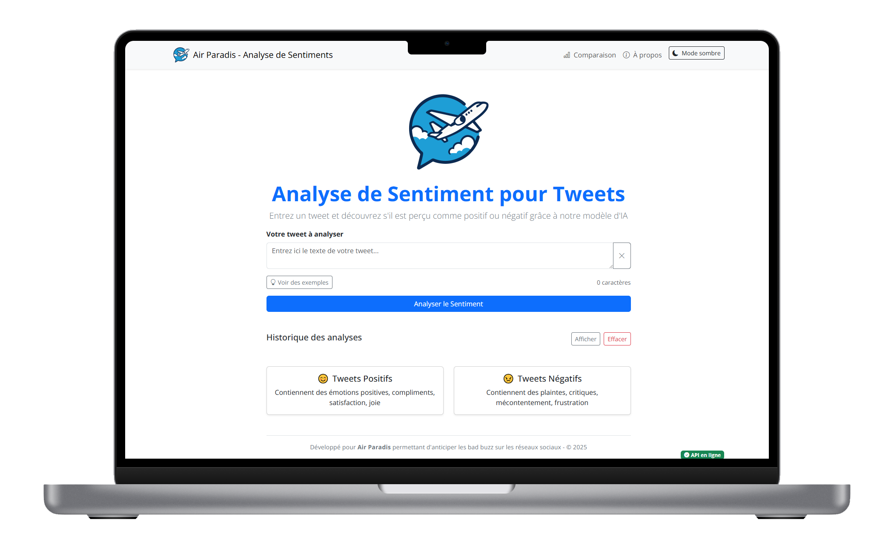

# Interface de Prédiction de Sentiment pour Tweets

Cette interface utilisateur permet d'analyser le sentiment (positif/négatif) des tweets grâce à un modèle d'intelligence artificielle. Elle a été développée dans le cadre d'un projet MLOps pour la compagnie **Air Paradis** afin d'anticiper les bad buzz sur les réseaux sociaux.



## Architecture

L'application est composée de deux parties principales :

1. **Frontend** : Application Next.js avec Bootstrap pour l'interface utilisateur
2. **Backend** : API FastAPI qui expose un modèle de deep learning pour l'analyse de sentiment

## Fonctionnalités

- Analyse du sentiment d'un tweet unique
- Comparaison de plusieurs tweets simultanément
- Historique des analyses effectuées
- Exemples de tweets positifs et négatifs
- Système de feedback pour améliorer le modèle
- Interface responsive et intuitive
- Mode clair/sombre

## Installation

### Prérequis

- Node.js (v18+)
- npm

### Configuration de .env.local

Avant de lancer l'application Next.js, il est impératif de configurer un fichier `.env.local` et lui indiquer l'adresse de l'API du serveur de prédiction. 

```
# Configuration du backend
NEXT_PUBLIC_API_URL=http://localhost:8000

# Environnement (development, production)
NODE_ENV=development
```

### Frontend (Next.js)

Pour lancer l'interface utilisateur, il faut exectuer ces commandes :

1. Se déplacer dans le répertoire : 
```bash
cd app/frontend/
```

2. Installer les dépendances :
```bash
npm install
```

3. Démarrer le serveur de développement :
```bash
npm run dev
```

L'application sera accessible à l'adresse : http://localhost:3000

## Structure de l'application Next.js

```
├── app/                  # Dossier principal Next.js
│   ├── about/            # Page À propos
│   ├── compare/          # Page Comparaison
│   ├── globals.css       # Styles globaux
│   ├── layout.js         # Layout principal
│   └── page.js           # Page d'accueil
├── components/           # Composants React
│   ├── ApiStatus.js      # Statut de connexion à l'API
│   ├── BootstrapClient.js # Chargement de Bootstrap côté client
│   ├── ExampleTweets.js  # Exemples de tweets
│   ├── FeedbackForm.js   # Formulaire de feedback
│   ├── NavBar.js         # Barre de navigation
│   ├── ResultCard.js     # Carte de résultat
│   └── TweetForm.js      # Formulaire principal
└── public/               # Fichiers statiques
├── utils/                # Dossier de fonctions utiles
│   └── actions.js        # Server Actions
```

## Déploiement

Pour déployer l'application en production :

1. Construire l'application Next.js
```bash
npm run build
```

2. Démarrer l'application en mode production
```bash
npm start
```

## Modèle d'IA

L'application effectue des requêtes pour obtenir les prédictions auprès du serveur de l'API FastAPI. Le modèle utilisé est un réseau neuronal LSTM entraîné sur un large corpus de tweets. Il est capable de classifier les tweets comme positifs ou négatifs avec un niveau de confiance associé.
